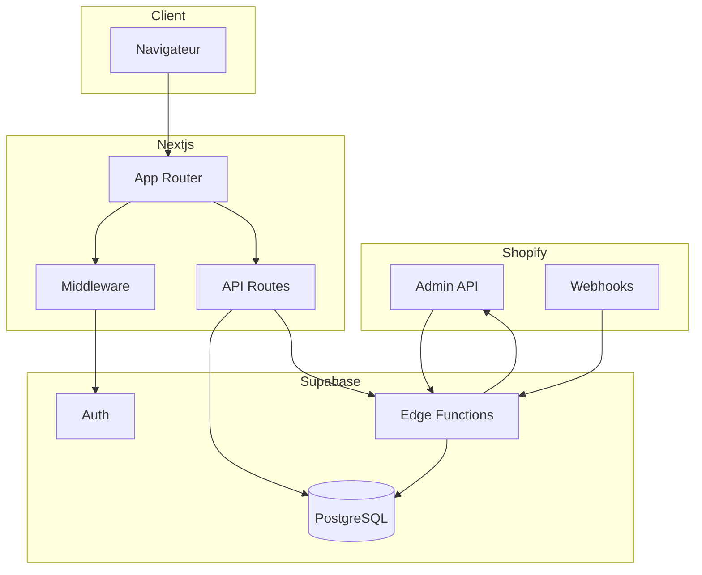
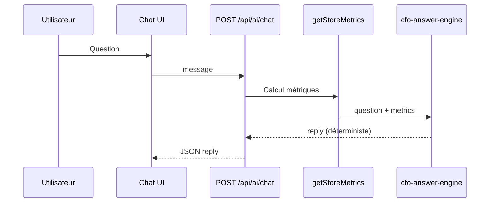

# Architecture

## Stack technique

| Couche | Technologie | Rôle |
|--------|-------------|------|
| Frontend | Next.js 16 (App Router), React 19, TypeScript | UI, routes API légères |
| Styles | Tailwind CSS 4 | Design system |
| Auth & BDD | Supabase (Auth, PostgreSQL, RLS) | Utilisateurs, données métier |
| Sync lourd | Supabase Edge Functions (Deno) | Pagination Shopify, webhooks |
| E-commerce | Shopify Admin API (OAuth) | Commandes, produits, clients |
| Paiements | Stripe | Abonnements, portail |
| Hébergement cible | Vercel (app) + Supabase (BDD + functions) | — |

## Arborescence applicative

```
pilotCFO/
├── src/
│   ├── app/                    # Routes Next.js (pages + API)
│   │   ├── (auth)/             # login, signup
│   │   ├── (dashboard)/        # overview, settings, …
│   │   ├── api/                # REST handlers
│   │   ├── onboarding/
│   │   └── questionnaire/
│   ├── components/             # UI réutilisable
│   ├── lib/
│   │   ├── cfo-engine/         # ★ Source de vérité financière
│   │   ├── data/metrics.ts     # Agrégation BDD → moteur
│   │   ├── shopify/            # OAuth, fetch, sync legacy
│   │   ├── ai/                 # Moteur de réponses AI CFO
│   │   ├── i18n/               # FR / EN
│   │   └── supabase/           # Clients, middleware
│   └── middleware.ts           # Session + parcours auth
├── supabase/
│   ├── migrations/             # Schéma SQL versionné
│   └── functions/              # Edge Functions Deno
└── public/brand/               # Assets (logo)
```

## Flux de données



### Lecture des métriques (dashboard)

1. Page serveur appelle `getStoreMetrics()` (`src/lib/data/metrics.ts`).
2. Chargement `orders`, `products`, `financial_profiles` pour le `store_id` actif (30 / 60 jours).
3. Passage au **moteur CFO** → objet `CFOMetrics`.
4. Rendu des composants dashboard.

> **Note importante** : la sync v2 écrit dans `shopify_orders`, `shopify_products`, `shopify_customers`. Les dashboards lisent encore les tables legacy `orders` / `products` après sync OAuth in-app. Pour aligner les métriques sur sync v2, brancher `getStoreMetrics()` sur les tables `shopify_*` (roadmap technique).

### Synchronisation Shopify

| Étape | Mécanisme |
|-------|-----------|
| Connexion OAuth | `GET /api/shopify/auth` → Shopify → `GET /api/shopify/callback` |
| Sync initiale | `syncShopifyStore()` (Next.js, service role) → tables `orders`, `products`, `customers` |
| Sync complète | Edge Function `sync-shopify-data` → tables `shopify_*` (12 mois, pagination Link) |
| Temps réel | Webhooks → Edge Functions `webhooks-*` |

## Authentification et parcours

Le middleware (`src/lib/supabase/middleware.ts`) :

1. Rafraîchit la session Supabase (cookies).
2. Redirige les anonymes vers `/login` (sauf routes publiques).
3. Enforce **onboarding** puis **questionnaire** via cookies + fallback DB.
4. Optimisation : cookies `pilotcfo_onboarding_done`, `pilotcfo_questionnaire_done`, `pilotcfo_cfo_done` pour éviter une requête SQL à chaque navigation.

Routes publiques : `/`, `/login`, `/signup`, `/api/stripe/webhook`, `/api/shopify/callback`.

## AI CFO



Pas d’appel OpenAI dans le flux actuel (`route.ts` → `answerCfoQuestion`).

## Mode démo

Si `NEXT_PUBLIC_DEMO_MODE=true`, `getStoreMetrics()` retourne des métriques fictives (`src/lib/demo/metrics.ts`) et le middleware ne force pas Supabase. **Désactivé par défaut** en production.

## Dépendances clés

| Package | Usage |
|---------|--------|
| `@supabase/ssr` | Auth cookies serveur |
| `@shopify/shopify-api` | Helpers Shopify (partiel) |
| `stripe` | Checkout, webhooks |
| `zod` | Validation API |
| `date-fns` | Fenêtres temporelles métriques |
| `framer-motion` | Animations questionnaire |
