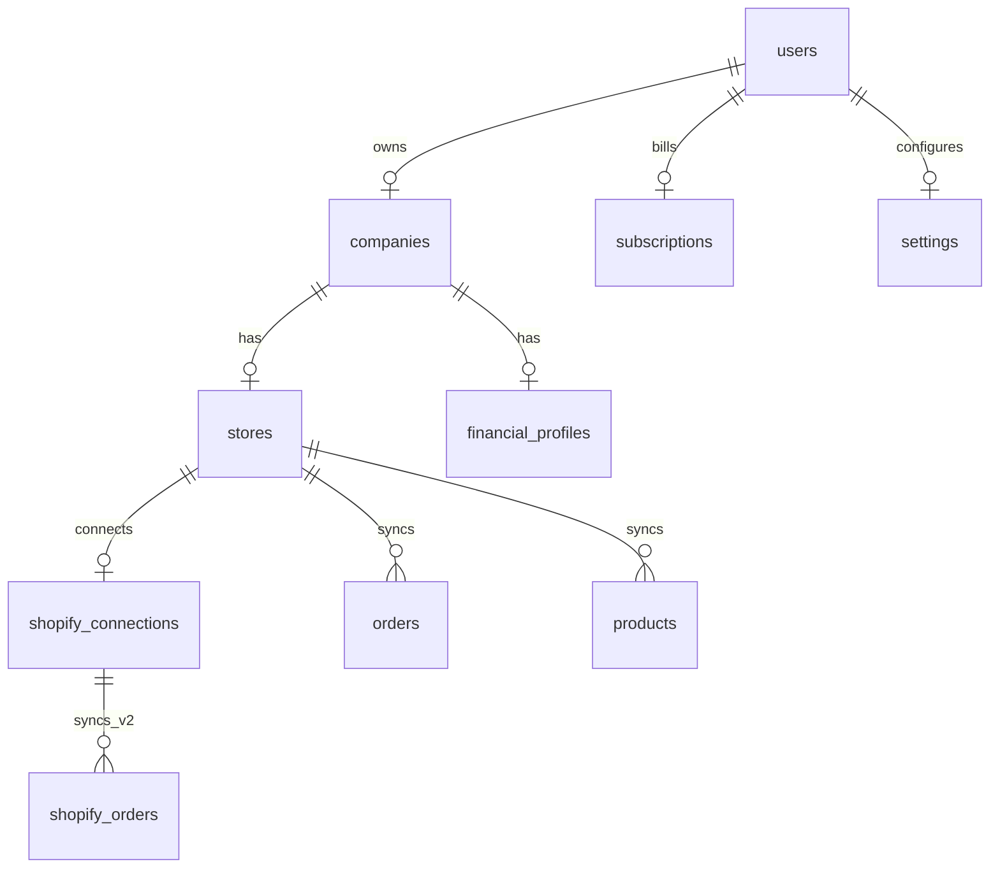

# Base de données

PostgreSQL hébergé sur **Supabase**, avec **Row Level Security (RLS)** sur toutes les tables métier.

## Migrations

| Fichier | Contenu |
|---------|---------|
| `001_initial_schema.sql` | Schéma complet v1, RLS, triggers `updated_at` |
| `002_users_insert_policy.sql` | Policy INSERT sur `users` (création profil) |
| `003_shopify_sync_v2.sql` | Tables `shopify_*`, colonnes sync sur `shopify_connections` |

Toujours appliquer dans l’ordre numérique.

## Modèle entité-relation (simplifié)



## Tables principales

### Identité & entreprise

| Table | Clé | Description |
|-------|-----|-------------|
| `users` | `id` → `auth.users` | Profil app (onboarding, questionnaire flags) |
| `companies` | `user_id` UNIQUE | Entreprise marchande |
| `settings` | `user_id` UNIQUE | Notifications, préférences JSON |

### Shopify

| Table | Description |
|-------|-------------|
| `stores` | Boutique (`shopify_domain` UNIQUE) |
| `shopify_connections` | Token OAuth, `sync_status`, `last_synced_at` |
| `orders` | Commandes sync **legacy** (Next.js) |
| `products` | Produits sync **legacy** |
| `customers` | Clients sync **legacy** |
| `shopify_orders` | Commandes sync **v2** (JSON line_items, refunds) |
| `shopify_products` | Produits v2 (variants JSON, cost) |
| `shopify_customers` | Clients v2 |

### Finance & produit

| Table | Description |
|-------|-------------|
| `financial_profiles` | Réponses questionnaire CFO |
| `audits` | Diagnostics (scores, findings JSON) |
| `reports` | Rapports générés par période |

### Engagement

| Table | Description |
|-------|-------------|
| `ai_conversations` / `ai_messages` | Historique chat (structure prête) |
| `activity_logs` | Audit trail utilisateur |
| `subscriptions` | État Stripe |

## Enums

```sql
subscription_status: trialing | active | past_due | canceled | unpaid
subscription_plan: trial | starter | growth | scale
audit_status: pending | running | completed | failed
report_type: monthly | quarterly | annual | custom
activity_action: login | shopify_connected | shopify_synced | ...
```

## Row Level Security

Principe : **`auth.uid() = user_id`** (directement ou via jointure `companies`).

Exemples :

- `users` : lecture/écriture de sa propre ligne
- `companies` : `user_id = auth.uid()`
- `stores` : via `company_id` → `companies.user_id`
- `shopify_orders` : `user_id = auth.uid()` (migration 003)

Les opérations serveur sensibles (OAuth callback, sync initiale) utilisent **`SUPABASE_SERVICE_ROLE_KEY`** côté Next.js — jamais exposée au client.

## Index importants

| Index | Table | Usage |
|-------|-------|-------|
| `idx_orders_store_ordered` | `orders` | Agrégation 30j |
| `idx_shopify_orders_user_created` | `shopify_orders` | Liste / analytics v2 |

## Triggers

Fonction `update_updated_at()` : met à jour `updated_at` sur INSERT/UPDATE pour la plupart des tables métier.

## Création profil utilisateur

À l’inscription Supabase Auth, le profil `public.users` doit exister. Policy `002` autorise l’INSERT par l’utilisateur authentifié. Helper : `src/lib/supabase/ensure-profile.ts`.

## Sauvegarde & rétention

| Environnement | Recommandation |
|---------------|----------------|
| Production | Backups Supabase Pro, PITR si disponible |
| Dev | Pas de données PII réelles |

## Évolution schéma

1. Créer `004_<description>.sql`
2. Tester en staging
3. Appliquer via CLI ou SQL Editor
4. Mettre à jour `src/types/database.ts` si types générés manuellement
