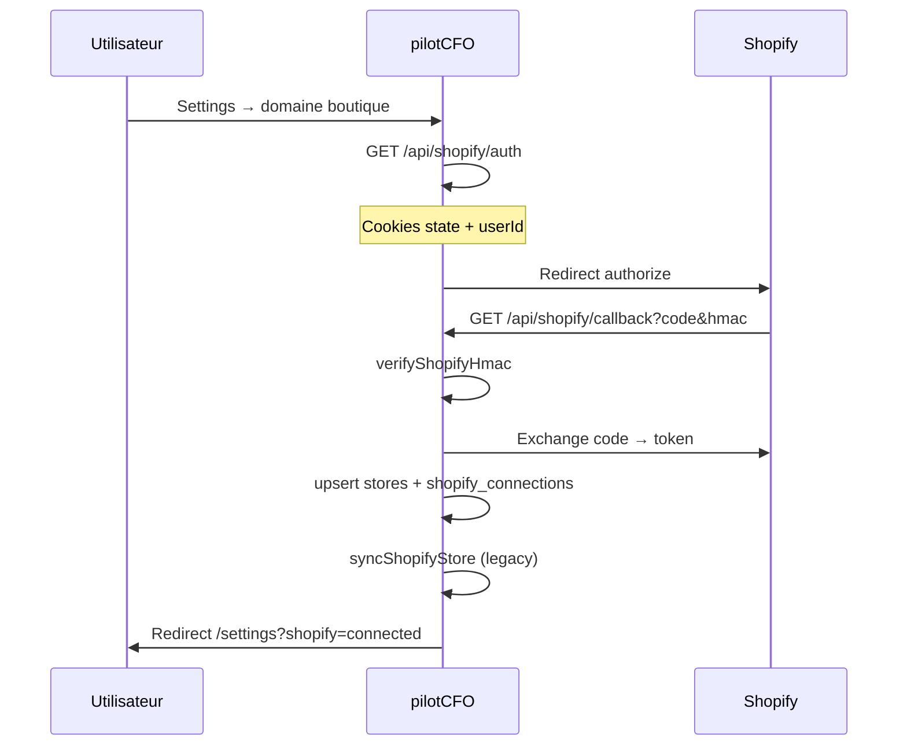

# Intégration Shopify

## Vue d'ensemble

pilotCFO utilise une **app custom** Shopify Partners (pas une app publique App Store obligatoire en phase dev). Le flux standard **OAuth 2.0** obtient un `access_token` stocké chiffré en base (accès restreint service role).

## Flux OAuth



### Endpoints Next.js

| Route | Méthode | Rôle |
|-------|---------|------|
| `/api/shopify/auth` | GET | Démarre OAuth, pose cookies |
| `/api/shopify/callback` | GET | Valide HMAC, enregistre token, sync initiale |
| `/api/shopify/sync` | POST | Invoke Edge Function `sync-shopify-data` |

### Fichiers clés

- `src/lib/shopify/client.ts` — HMAC, échange token, `shopifyAdminFetch`
- `src/lib/shopify/sync.ts` — Sync legacy vers `orders` / `products` / `customers`
- `src/components/settings/shopify-connect.tsx` — UI connexion + sync

## Boutique de développement

**Obligatoire en test** : une Development Store créée dans Partners.

| Erreur fréquente | Cause |
|------------------|-------|
| Domaine « unavailable » | Pas une vraie boutique / typo |
| Redirect URI mismatch | URL callback ≠ config Partners |
| `example.com` comme App URL | Shopify refuse ou redirige mal |

Vérifier : `https://<store>.myshopify.com/admin` accessible.

## Scopes Admin API

Minimum recommandé :

```
read_orders
read_products
read_customers
read_inventory
read_analytics
```

Ajuster `SHOPIFY_SCOPES` et re-autoriser la boutique après changement.

## Synchronisation des données

### Sync initiale (callback OAuth)

`syncShopifyStore()` — exécutée côté Next.js avec service role. Peuple les tables **legacy**.

### Sync complète (Edge Function)

Déclenchée par :

- Bouton **Sync now** (Settings)
- `POST /api/shopify/sync`
- `supabase.functions.invoke('sync-shopify-data')`

Comportement `sync-shopify-data` :

| Ressource | Période / détail |
|-----------|------------------|
| Orders | 12 mois, `status=any`, pagination `Link` |
| Products | Variants + `cost` si disponible |
| Customers | Liste paginée |

Écrit dans `shopify_orders`, `shopify_products`, `shopify_customers`. Met à jour `shopify_connections.sync_status` : `never` → `syncing` → `success` \| `error`.

### Coût produit (`cost`)

Priorité dans la sync v2 :

1. Champ `cost` sur variant Shopify
2. Sinon estimation via profil questionnaire (`avg_product_cost_pct`)

## Webhooks

Enregistrement automatique après connexion (`register-shopify-webhooks`) :

| Topic Shopify | Function |
|---------------|----------|
| `orders/create` | `webhooks-orders-create` |
| `orders/updated` | `webhooks-orders-updated` |
| `orders/cancelled` | `webhooks-orders-cancelled` |
| `refunds/create` | `webhooks-refunds-create` |
| `products/update` | `webhooks-products-update` |
| `app/uninstalled` | `webhooks-app-uninstalled` |

Chaque handler :

1. Vérifie **HMAC** (`X-Shopify-Hmac-Sha256`)
2. Résout `shop_id` via domaine boutique
3. Upsert / soft-delete en base

## Sécurité OAuth

- **State** aléatoire en cookie, comparé au callback
- **HMAC** sur query string callback
- **userId** en cookie httpOnly pendant le flux (durée courte)

## Désinstallation

Webhook `app/uninstalled` : marque `shopify_connections.connected = false`, arrête la sync.

## Limites API Shopify

| Limite | Mitigation |
|--------|------------|
| 250 items / page | Pagination `Link` dans `_shared/shopify.ts` |
| Rate limit (leaky bucket) | Retry/backoff à renforcer en prod |
| Custom apps vs public | Dev store suffit pour MVP |

## Checklist mise en production

- [ ] App URL HTTPS production
- [ ] Redirect URI exacte
- [ ] `SHOPIFY_API_SECRET` identique Partners + Edge secrets
- [ ] Edge Functions déployées
- [ ] `SUPABASE_FUNCTIONS_URL` configuré
- [ ] Webhooks visibles dans Partners → app → API access
