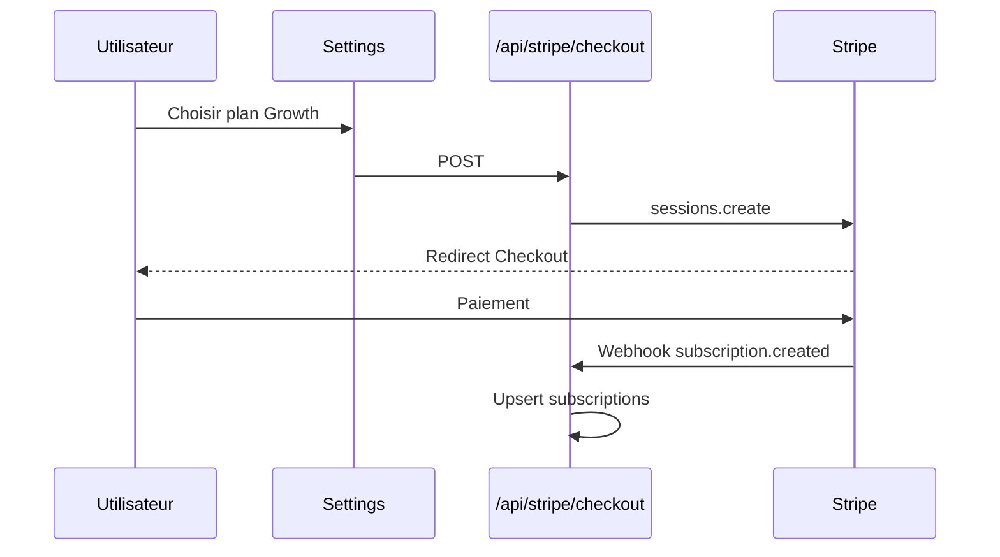

# Facturation Stripe

## Modèle

- **Essai** : 14 jours (`subscriptions.status = trialing`)
- **Abonnement récurrent** : plans Starter / Growth via Stripe Checkout
- **Portail client** : gestion carte, annulation

## Configuration Stripe Dashboard

### 1. Produits et prix

Créer deux produits (ou un produit deux prix) :

| Plan interne | Variable env |
|--------------|--------------|
| Starter | `STRIPE_PRICE_ID_STARTER` |
| Growth | `STRIPE_PRICE_ID_GROWTH` |

### 2. Webhook

| Paramètre | Valeur |
|-----------|--------|
| Endpoint | `{NEXT_PUBLIC_APP_URL}/api/stripe/webhook` |
| Events | `customer.subscription.created`, `updated`, `deleted`, `invoice.paid`, `invoice.payment_failed` |

Copier **Signing secret** → `STRIPE_WEBHOOK_SECRET`.

### 3. Clés API

| Variable | Type |
|----------|------|
| `STRIPE_SECRET_KEY` | Serveur |
| `NEXT_PUBLIC_STRIPE_PUBLISHABLE_KEY` | Client |

## Flux Checkout



Fichiers :

- `src/lib/stripe/index.ts` — client Stripe, helpers
- `src/app/api/stripe/checkout/route.ts`
- `src/app/api/stripe/webhook/route.ts`
- `src/components/settings/subscription-panel.tsx`

## Portail client

`POST /api/stripe/portal` → URL Stripe Billing Portal pour l’utilisateur connecté (`stripe_customer_id` en base).

## Table `subscriptions`

| Colonne | Description |
|---------|-------------|
| `stripe_customer_id` | ID Stripe Customer |
| `stripe_subscription_id` | ID abonnement |
| `plan` | `trial` \| `starter` \| `growth` \| `scale` |
| `status` | Aligné enum PostgreSQL |
| `trial_ends_at` | Fin essai |
| `cancel_at_period_end` | Annulation fin période |

## Webhook handler

Le handler vérifie la signature Stripe (`constructEvent`) puis met à jour `subscriptions` et logue dans `activity_logs`.

**Important** : route webhook **exclue** du middleware auth — uniquement signature Stripe.

## Test local

```bash
stripe listen --forward-to localhost:3000/api/stripe/webhook
```

Utiliser la clé `whsec_` affichée par la CLI dans `.env.local`.

## Feature gating (roadmap)

Mapper `subscriptions.plan` aux routes :

| Feature | Plan minimum |
|---------|--------------|
| Forecasts | Growth |
| AI CFO illimité | Growth |
| Rapports PDF | Growth |

Non enforced en code v1 — à implémenter dans middleware ou layout dashboard.
