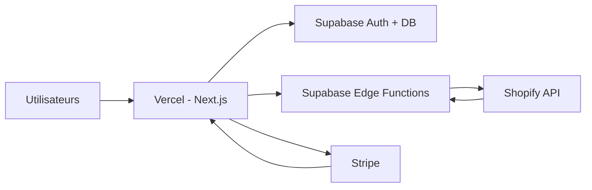

# Déploiement

## Architecture production cible



## 1. Supabase (production)

1. Créer projet **Production** (séparé de dev).
2. Exécuter migrations `001` → `003`.
3. Configurer Auth URLs avec domaine final.
4. Déployer Edge Functions + secrets (voir [Edge Functions](./07-edge-functions.md)).
5. Activer backups automatiques.

## 2. Vercel

```bash
# CLI optionnelle
vercel link
vercel env pull
vercel --prod
```

### Variables d'environnement Vercel

Copier toutes les variables de [Configuration](./04-configuration.md).

| Variable | Environnement |
|----------|---------------|
| `NEXT_PUBLIC_*` | Production + Preview |
| `SUPABASE_SERVICE_ROLE_KEY` | Production only (pas Preview public si possible) |
| `STRIPE_*` live | Production |
| `STRIPE_*` test | Preview |

### Build

- Framework : Next.js (auto-détecté)
- Command : `npm run build`
- Node 20.x

## 3. Domaine

| Service | DNS |
|---------|-----|
| App | `app.votredomaine.com` → Vercel |
| Supabase | Fourni par Supabase (`*.supabase.co`) |

Mettre à jour :

- `NEXT_PUBLIC_APP_URL`
- `SHOPIFY_APP_URL`
- Supabase Auth Site URL
- Shopify Partners redirect URLs
- Stripe webhook URL

## 4. Shopify Partners (production)

- Passer de dev store tests à boutiques réelles selon modèle (custom app / public app).
- Soumettre scopes justifiés si App Store public.

## 5. Stripe (production)

- Basculer clés `sk_live_` / `pk_live_`
- Webhook production pointant vers domaine Vercel
- Produits/prix live

## 6. CI/CD (recommandé)

Pipeline GitHub Actions minimal :

```yaml
# .github/workflows/ci.yml (exemple)
on: [push, pull_request]
jobs:
  build:
    runs-on: ubuntu-latest
    steps:
      - uses: actions/checkout@v4
      - uses: actions/setup-node@v4
        with: { node-version: "20" }
      - run: npm ci
      - run: npm run lint
      - run: npm run build
```

Déploiement Supabase Functions :

```yaml
  deploy-functions:
    if: github.ref == 'refs/heads/main'
    steps:
      - run: supabase functions deploy --project-ref $REF
```

## 7. Post-déploiement

| Test | Action |
|------|--------|
| Inscription prod | Email reçu, redirect OK |
| OAuth Shopify | Connexion boutique réelle |
| Sync | `shopify_orders` peuplé |
| Webhook | Commande test → ligne mise à jour |
| Stripe | Checkout test mode puis live |
| AI CFO | Réponse avec métriques réelles |

## 8. Observabilité

| Outil | Usage |
|-------|--------|
| Vercel Analytics | Performance frontend |
| Supabase Logs | DB, Auth, Functions |
| Stripe Dashboard | Paiements échoués |
| Sentry (optionnel) | Erreurs JS/API |

## Rollback

1. Vercel : promote deployment précédent
2. Migrations DB : scripts `DOWN` manuels (pas de down auto fourni)
3. Functions : redéployer commit git précédent
